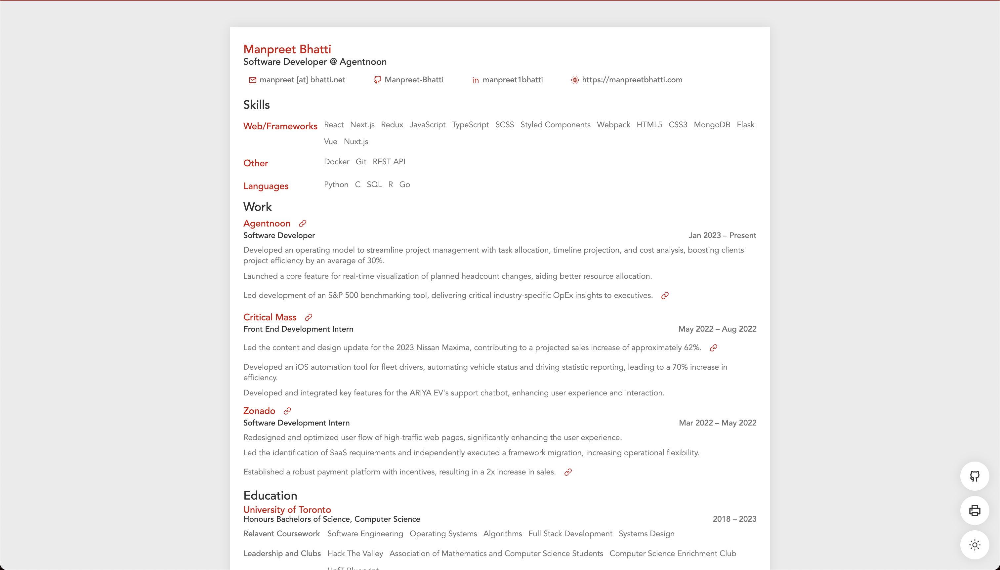

# my-resume-2

## Overview

### Purpose

I wanted to have a resume ready at-hand for when anyone was interested in me/my work. Of course, I could provide them with a PDF of my resume but that's not something I carry around with me at all times; a solution for that was an online copy, accessible from both web/mobile, at all times. Think of it as a digital business card.

### Features

- Clickable socials (email, LinkedIn, GitHub, etc)
- Light/dark mode
- Print-friendly

## Demo



## Stack

### Frontend

- Gatsby, Tailwind CSS, TypeScript, React

### Content management

- Contentful

### Hosting

- Netlify

## Installation and Setup

### Clone and access app

```bash
git clone https://github.com/Manpreet-Bhatti/my-resume-2
cd my-resume-2
npm install
```

### Gatsby config

> Note: since we're using Gatsby, you'll have to make some changes in `gatsby-config.ts`

Make sure to change the `siteMetadata` which will be used to describe the base of your resume.

`package.json` also has some values that you'd be interested in changing such as `description` (which is used in the `siteMetadata`) and `author`.

Once you've taken a look at those things, point your attention to the plugins, specifically `gatsby-source-contentful`. I used a CMS to retrieve my resume data. You can, however, use your own methods to do so. For example, using another CMS, keeping your data locally, or hosting your data in a database. **Note that no content will be shown if you decide to make no changes as it depends on the CMS I'm using**.

Make sure to look through the [Gatsby plugins](https://www.gatsbyjs.com/plugins) offered to help you develop your resume to your needs.

## Running the Project

To run the project locally, the following:

```bash
npm run start
```

> Take a look at `package.json` to view other scripts that you can run. Feel free to add your own scripts for actions such as linting

## Customization

I decided to use Tailwind CSS to style my resume. Feel free to use other styling engines to make yours look unique to yourself. Gatsby has built-in CSS support but holds [numerous options](https://www.gatsbyjs.com/docs/how-to/styling/built-in-css/) for styling.

### Tailwind

If you decided to stick to Tailwind CSS, make sure to change the values in `tailwind.config.ts`. This file holds all sorts of customizations to UI such as theme extensions and dark mode enabling. You can also place your custom fonts here, or, you can hold out for the `global.css`.

### Global css

Found in `/src/styles`, `global.css` is highly important for default styles you'd like to place and forget about. Things like `font-family`, the colour of your text, etc. More importantly, this file is responsible for tinkering with `#gatsby-focus-wrapper`, an under-the-hood HTML id, which allows for the resume to have a centered feel when viewing on the browser.

Be careful about the styles you put here as they're globally applied, but be sure to use this file to your advantage too to make things smoother when developing.

### Icons

I used [React Icons](https://react-icons.github.io/react-icons/) throughout the application. Again, feel free to use whatever icon library you prefer.

### Layout

The way the resume is structured relies all on the OneColumn layout. Feel free to change things around here, moving sections around, rendering data in certain ways, etc.

## Deployment

I intended on using Netlify as they've absorbed Gatsby Cloud. You can use any other hosting service (Vercel is a great one) to fulfil your needs.

### Netlify

If you plan on sticking to Netlify, here's how you can deploy your resume.

Within the "Site configuration" section, you'll have to access the "Build & deploy" tab, where you'll add your repository (within "Continuous deployment") which Netlify will use to build and serve your resume. Be sure to view other options that you feel are needed, but you'll mostly need to configure things like "Build settings" and "Dependency management".

It would also be a good idea to add any environment variables within "Environment variables" in "Build & deploy".

Lastly, if you have a domain, you'll have to add that to the "Domain management" tab to see your resume on a URL that _isn't_ the generic Netlify one.

Once you've done all those things, you'll be able to see the latest commit as your served resume.

## License

Since this application is released under the MIT license, you're free to create a copy and make it your own with whatever changes you'd like.

## Contact

If you'd like to connect, feel free to find me via LinkedIn or email (found in the resume). I'd also be happy to answer any questions via email.
