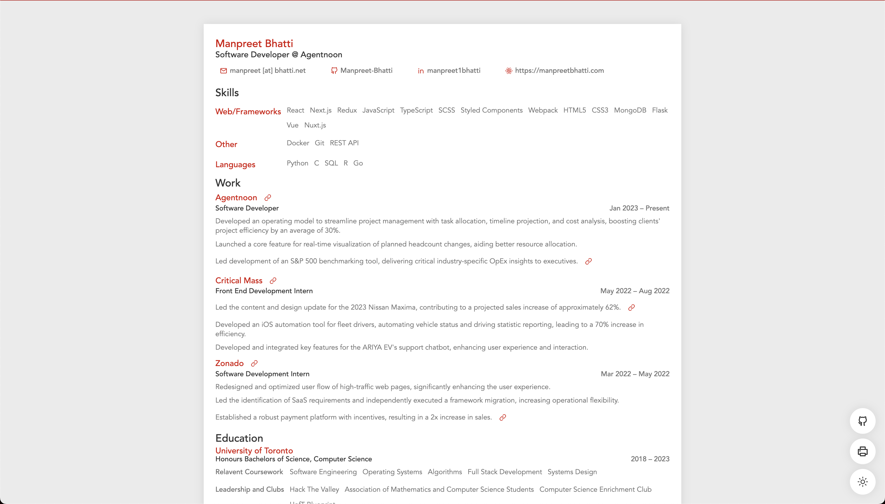

# my-resume-2

[](https://app.netlify.com/sites/manpreet-bhatti-resume/deploys)

## Overview

### Purpose

A digital resume accessible from both web and mobile at all times — a shareable alternative to carrying a PDF.

### Features

- Clickable socials (email, LinkedIn, GitHub, etc)
- Light/dark mode
- Print-friendly

## Demo



## Stack

### Frontend

- Astro, Tailwind CSS, TypeScript, React

### Content

- Local TypeScript data files (`src/data/`)

### Hosting

- Netlify

## Installation and Setup

### Clone and access app

```bash
git clone https://github.com/Manpreet-Bhatti/my-resume-2
cd my-resume-2
npm install
```

### Configuration

All resume content lives in `src/data/`:

| File | Content |
|------|---------|
| `header.ts` | Name, title, contact links |
| `meta.ts` | Page metadata (title, description) |
| `work.ts` | Work experience entries |
| `education.ts` | Education entries |
| `projects.ts` | Project entries |
| `skills.ts` | Skills list |

Edit these files to populate your own resume data.

`package.json` holds `description` and `author` values you may also want to update.

## Running the Project

```bash
npm run start
```

> See `package.json` for all available scripts (`build`, `preview`, `typecheck`).

## Customization

### Tailwind CSS

Styles use Tailwind CSS v4. Global defaults (fonts, base colors, etc.) live in `src/styles/global.css`.

### Icons

[React Icons](https://react-icons.github.io/react-icons/) is used throughout. Swap in any other icon library as needed.

### Layout

Sections are in `src/sections/` as `.astro` files. Rearrange or modify them in `src/pages/index.astro`. Interactive components (theme toggle, nav) are React components in `src/components/`.

## Deployment

### Netlify

In "Site configuration" → "Build & deploy":

1. Connect your repository under "Continuous deployment"
2. Build command: `npm run build`
3. Publish directory: `dist`
4. Add any environment variables under "Environment variables"
5. Set a custom domain under "Domain management" if desired

## License

Released under the MIT license — fork and make it your own.

## Contact

Connect via LinkedIn or email (found in the resume).
